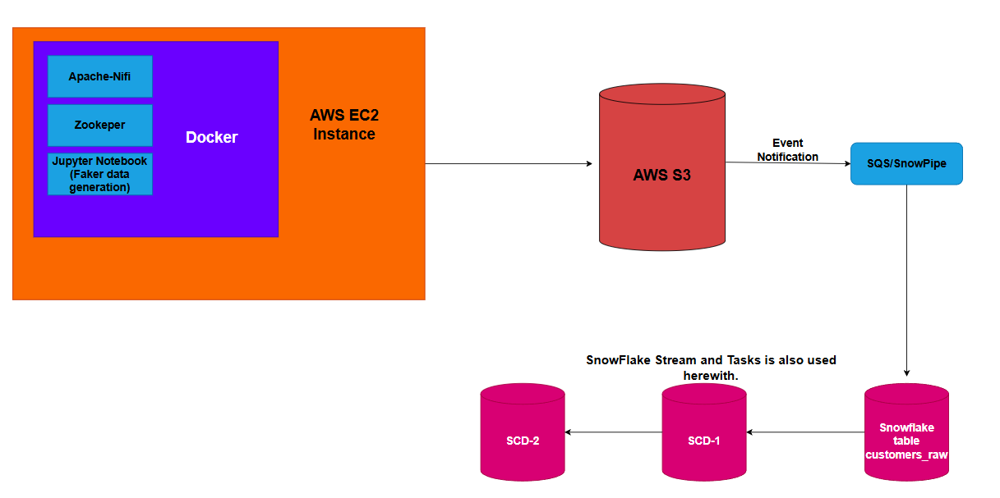

# SnowFlake-Nifi-ETL-Pipeline
Using Apache Nifi for Data Creation, S3 for data storage and Snowflake for loading and scd of data.


# Snowflake Customer Data Pipeline (Docker, NiFi, S3, Snowpipe)

This project is an end-to-end **data engineering pipeline** that:

- Generates fake customer data with **Jupyter + Faker**
- Moves CSV files through **Apache NiFi** into an **Amazon S3** bucket
- Auto-loads data into **Snowflake** using **Snowpipe**
- Builds **SCD Type 1** and **SCD Type 2** tables from a raw staging table

---

## Architecture Overview

**How Data flows in the Project:**

1. **Docker Compose on AWS EC2** runs:
   - Apache NiFi  
   - ZooKeeper  
   - Jupyter Notebook (with Faker)
2. Jupyter generates **CSV files** with fake customer data using Faker Library.
3. NiFi picks up the CSV files and uploads them to an **S3 bucket**.
4. **S3 event notifications** (object created) trigger **Snowpipe** (via SQS).
5. Snowpipe loads data into a **raw table**: `CUSTOMER_RAW`.
6. A **Stream** on `CUSTOMER_RAW` captures new/changed rows.
7. **Tasks** use that stream and **SQL** to build:
   - `CUSTOMERS` (SCD Type 1 – latest state per customer)
   - `CUSTOMER_CHANGES_HISTORY` (SCD Type 2 – history of changes)

```text
Jupyter (Faker) --> CSV files --> Apache NiFi --> S3 Bucket
                                                      |
                                                      v
                                          S3 Event Notifications (SQS)
                                                      |
                                                      v
                                                    Snowpipe
                                                      |
                                                      v
                                                CUSTOMER_RAW
                                                 |       |
                                 Stream on RAW   |       v
                                                 |  SCD1: CUSTOMERS
                                                 |  SCD2: CUSTOMER_CHANGES_HISTORY

```
---

## How It Works & How to Run It

This section explains the flow **and** how you can roughly reproduce it.

### 1. Prerequisites

You will need:

* **AWS**

  * An **EC2 instance** (for Docker + Docker Compose)
  * An **S3 bucket** for the CSV files
  * **SQS** + **S3 Event Notification** (for Snowpipe auto-ingest)
* **Snowflake**

  * Account with permissions to create stages, pipes, tables, streams, and tasks
* **On EC2**

  * Docker
  * Docker Compose

You’ll also need to know or configure:

* `AWS_ACCESS_KEY_ID`, `AWS_SECRET_ACCESS_KEY`, `AWS_REGION`
* `S3_BUCKET_NAME`
* `SNOWFLAKE_ACCOUNT`, `SNOWFLAKE_USER`, `SNOWFLAKE_ROLE`
* `SNOWFLAKE_WAREHOUSE`, `SNOWFLAKE_DATABASE`, `SNOWFLAKE_SCHEMA`

These are usually stored in environment variables or a `.env` file used by Docker / scripts.

---

### 2. Clone the Repository

```bash
git clone https://github.com/<your-username>/<your-repo>.git
cd <your-repo>
```

Update any config files or environment variables in the repo to match your AWS & Snowflake setup.

---

### 3. Start the Docker Stack on EC2

From the project root:

```bash
docker-compose up -d
```

This will start:

* **Jupyter Notebook** (for generating data)
* **Apache NiFi** + **ZooKeeper** (for moving data into S3)

---

### 4. Generate Fake Customer Data (Jupyter + Faker)

1. Open the Jupyter Notebook URL exposed by your Docker setup.
2. Run the notebook that uses **Faker** to generate **customer CSV files**.
3. The notebook writes CSVs into a directory that NiFi is configured to watch.

Result: a small “stream” of CSV files appearing on the EC2 machine.

---


### 5. Move Files into S3 (Apache NiFi)

In the NiFi UI:

* A preconfigured flow:

  * Watches the directory where the CSVs are written.
  * Uploads each new CSV into the configured **S3 bucket** (e.g. `s3://your-bucket/customers/`).

Check S3 to confirm that new CSV files are being created.

---

### 6. Auto-Load into Snowflake (Snowpipe → CUSTOMER_RAW)

In Snowflake, the project uses:

* An **external stage** pointing to the S3 bucket
* A **Snowpipe** that:

  * Is connected to S3 via **event notifications → SQS**
  * Automatically loads new CSV files

When a file lands in S3:

1. S3 sends an event to SQS.
2. Snowpipe reads the event and loads the file.
3. Data lands in the raw table:

```sql
SELECT * FROM CUSTOMER_RAW LIMIT 20;
```

This table is your **staging layer**.

---

### 7. Build SCD1 and SCD2 Tables (Streams & Tasks)

On top of `CUSTOMER_RAW`, the project creates:

* A **Stream** (e.g. `CUSTOMER_RAW_STREAM`) that tracks inserts/changes
* **Tasks** that periodically consume the stream and apply SCD logic

The tasks:

1. Read new data from `CUSTOMER_RAW_STREAM`
2. Update:

   * **SCD Type 1 table:** `CUSTOMERS`
     (always latest version of each customer)
   * **SCD Type 2 table:** `CUSTOMER_CHANGES_HISTORY`
     (tracks history with fields like `valid_from`, `valid_to`, `is_current`, etc.)

After the pipeline has run for a bit, you can inspect:

```sql
-- Raw staging data
SELECT * FROM CUSTOMER_RAW LIMIT 20;

-- Latest customer state (SCD1)
SELECT * FROM CUSTOMERS LIMIT 20;

-- Historical changes (SCD2)
SELECT * FROM CUSTOMER_CHANGES_HISTORY
ORDER BY customer_id, valid_from DESC
LIMIT 20;
```

---

## Example Snowflake Objects (Naming)

You can adapt names, but a typical setup looks like:

* **Stage:** `@S3_CUSTOMER_STAGE`
* **Pipe:** `PIPE_CUSTOMER_RAW`
* **Tables:** `CUSTOMER_RAW`, `CUSTOMERS`, `CUSTOMER_CHANGES_HISTORY`
* **Stream:** `CUSTOMER_RAW_STREAM`
* **Tasks:** e.g. `TASK_BUILD_CUSTOMERS`, `TASK_BUILD_CUSTOMER_HISTORY`

---

## Example Project Structure

Adjust to your actual repo layout:

```text
.
├── docker-compose.yml
├── nifi/
│   └── flow.xml.gz                # NiFi flow configuration (if exported)
├── notebooks/
│   └── generate_customers.ipynb   # Faker-based data generator
├── snowflake/
│   ├── create_stage_pipe.sql      # Stage + Snowpipe
│   ├── create_tables.sql          # CUSTOMER_RAW, CUSTOMERS, CUSTOMER_CHANGES_HISTORY
│   ├── create_streams_tasks.sql   # Stream + Tasks definitions
│   └── queries_example.sql        # Example queries to inspect data
└── README.md
```

---

## Ideas for Next Steps

* Add **dbt models** on top of the Snowflake tables.
* Plug a BI tool into `CUSTOMERS` and `CUSTOMER_CHANGES_HISTORY`.
* Swap Faker for a real-time source (Kafka, Kinesis, etc.) to make this closer to production.

